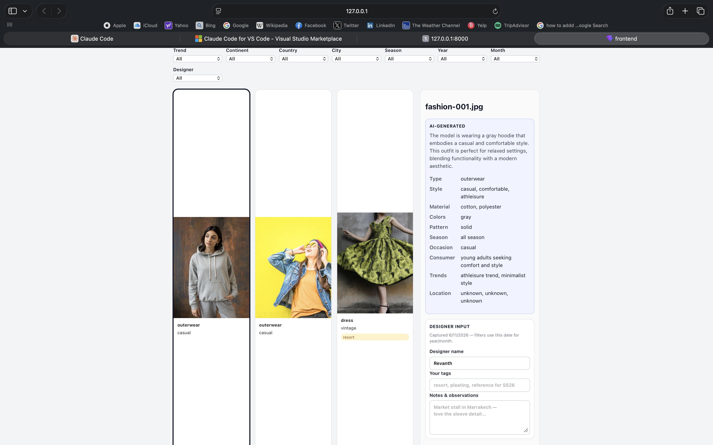
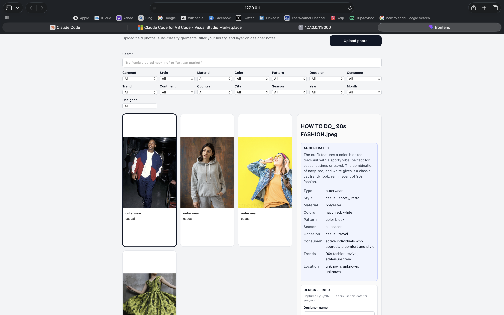
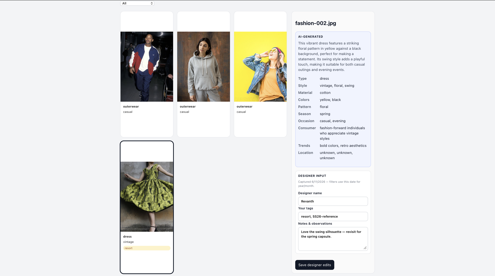
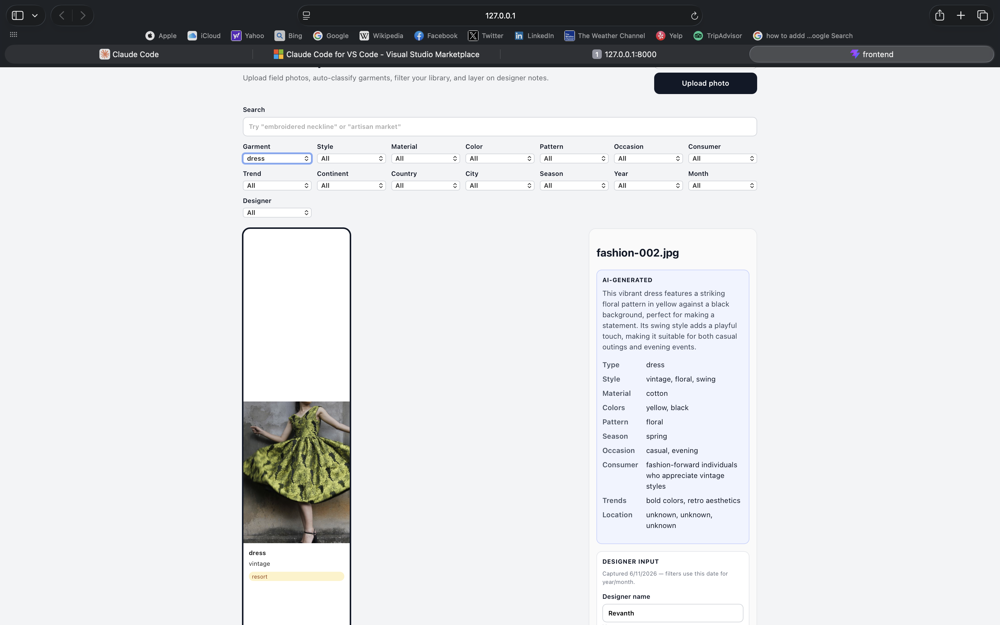
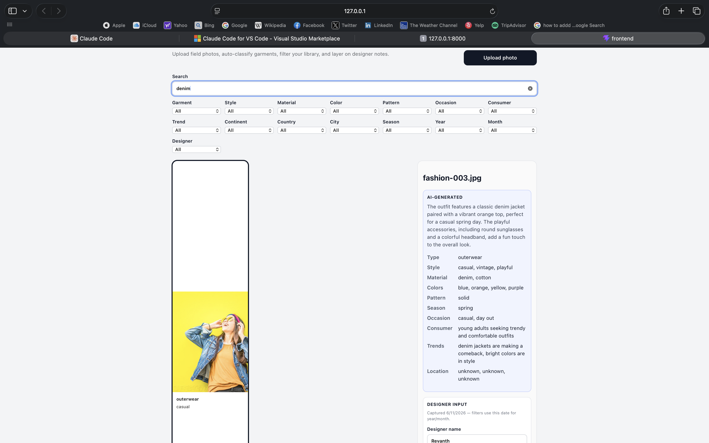

# Fashion Garment Classification & Inspiration Web App

A lightweight full-stack app for fashion designers to upload field inspiration photos, auto-classify garments with AI, search and filter across rich metadata, and add their own tags and notes over time.

## Problem & approach

Design teams collect thousands of reference photos from markets, stores, and street style. This POC turns that pile into a searchable library: upload → multimodal classification → visual grid with dynamic filters → designer annotations layered on top of AI output.

**Trade-offs (intentional for a one-day POC):**
- Single-user, no auth
- OpenAI vision for classification (swap-friendly)
- SQLite + FTS5 instead of Elasticsearch
- Location/time context split between AI inference (continent/country/city) and capture timestamp (year/month filters)

## Screenshots

| Gallery + filters | Upload + live classification |
|---|---|
|  |  |

| Detail: AI output vs designer input | Attribute filter applied |
|---|---|
|  |  |

| Full-text search ("denim") |
|---|
|  |

## What I built / What I learned / Limitations

**What I built.** An end-to-end pipeline that takes a raw inspiration photo,
classifies the garment with a multimodal model into structured attributes plus a
natural-language description, stores everything in SQLite with FTS5 full-text
search, and surfaces it through a React grid with dynamic filters. On top of the
AI output, designers can layer their own tags and notes, which are stored
separately but indexed alongside the AI text so a single search box spans both.

**What I learned.**
- FTS5 is a lot of leverage for a one-day POC — I get natural-language search over
  both AI descriptions and human notes without standing up a separate search
  service, as long as I sanitize raw query input so stray operators don't raise
  syntax errors.
- Keeping AI output and human annotations in separate columns (rather than
  merging them) kept the model honest and the UI clear about provenance — you can
  always tell what the model said versus what the designer added.
- Treating the Pydantic models as the single source of truth and mirroring them
  in the TypeScript types removed a whole class of frontend/backend drift bugs.
- The model is strong on broad descriptive tags but weak on exact taxonomy and
  geography, which pushed me toward "≥50% set overlap" scoring for list fields
  rather than demanding exact matches.

**Limitations.** Single-user with no auth; AI-inferred location is a scene guess,
not capture GPS; no pagination or deduplication yet; and the eval set isn't
bundled (you supply images locally). See *Limitations & next steps* below for the
full list and what I'd do with another day.

## Project structure

```
fashion-inspiration-app/
├── app/
│   ├── backend/          FastAPI, classifier, SQLite
│   └── frontend/         React + TypeScript
├── eval/                 labeled test set + accuracy script
├── tests/                unit, integration, e2e
└── README.md
```

## Setup

**Backend**

```bash
cd app/backend
python -m venv .venv
source .venv/bin/activate
pip install -r requirements.txt
cp .env.example .env   # add OPENAI_API_KEY
uvicorn main:app --reload
```

API docs: http://127.0.0.1:8000/docs

**Frontend**

```bash
cd app/frontend
npm install
npm run dev
```

App: http://127.0.0.1:5173

**Tests**

```bash
pip install -r requirements-dev.txt
pytest tests -q
```

## Architecture

```
React UI  →  FastAPI  →  OpenAI Vision (classify)
                ↓
           SQLite + FTS5 (metadata + full-text search)
                ↓
           uploads/ (image files)
```

**Classification** — `classifier.py` sends each image to `gpt-4o-mini` (configurable) and parses JSON into structured fields: garment type, style, material, colors, pattern, season, occasion, consumer profile, trend notes, location, and a natural-language description.

**Storage** — AI metadata lives in `classification_json`. Designer name, comma-separated tags, and free-text notes are stored separately and indexed in FTS so searches can hit both AI and human content.

**Filters** — `GET /filters` builds dropdown options from values already in the library (not hardcoded). Supports garment attributes plus continent/country/city, year/month from capture time, and designer.

## Features vs brief

| Requirement | Status |
|-------------|--------|
| Upload + AI classification | Done |
| Rich description + structured attributes | Done |
| Visual grid | Done |
| Dynamic attribute filters | Done |
| Location + time + designer filters | Done |
| Full-text search | Done |
| Designer tags/notes (distinct from AI) | Done |
| Eval script + labels template | Done (52 images, real `gpt-4o-mini` run) |
| Unit / integration / e2e tests | Done |

## Model evaluation

See `eval/README.md`. Quick start:

1. Add 50–100 images to `eval/images/` (Pexels/Unsplash fashion photos work well).
2. Label `eval/labels.csv` with expected attributes.
3. Run `python eval/evaluate.py` with `OPENAI_API_KEY` set.

**Dataset:** 52 Pexels fashion/street-style photos in `eval/images/` (run `python eval/download_images.py` to refresh).

**Labels:** of the 52 rows, 16 are hand-reviewed ground truth (`eval/manual_labels.py`)
and the remaining 36 are provisional drafts produced by the classifier itself. I'm
calling this out honestly: scoring against model-drafted labels is partly circular
and inflates agreement, so treat the headline numbers as indicative until the full
set is hand-labeled. The hand-reviewed subset is the more trustworthy signal. To
regenerate and run against the real model:

```bash
export OPENAI_API_KEY=your_key
python eval/curate_labels.py          # full AI draft labels
python eval/apply_manual_labels.py  # merge with hand-reviewed rows
python eval/evaluate.py
```

**Real eval run (`gpt-4o-mini`, 52 images):**

| Field | Correct | Accuracy |
|-------|---------|----------|
| garment_type | 27/52 | 51.9% |
| style_tags | 10/52 | 19.2% |
| materials | 26/52 | 50.0% |
| colors | 10/52 | 19.2% |
| patterns | 25/52 | 48.1% |
| season | 43/52 | 82.7% |
| occasion | 34/52 | 65.4% |
| consumer_profile | 1/52 | 1.9% |
| trend_notes | 0/52 | 0.0% |
| continent | 46/52 | 88.5% |
| country | 49/52 | 94.2% |
| city | 51/52 | 98.1% |

Scoring: exact (case-insensitive) match for scalar fields; ≥50% set overlap for
list fields. Run it yourself with `python eval/evaluate.py` and a valid
`OPENAI_API_KEY` — predictions are cached in `eval/predictions_cache.json`, so a
re-score is instant and free.

**An important caveat I caught while evaluating.** The first version of the harness
scored `garment_type` and `season` at a flat 0%. That was a bug, not the model:
`model_dump()` serialized the enum to `"GarmentType.DRESS"` instead of `"dress"`,
so the comparison could never match. After fixing it to `model_dump(mode="json")`,
those fields jumped to 51.9% and 82.7%. Worth flagging because it shows why you have
to sanity-check an eval, not just trust the first number it prints.

**Where the model does well:** season (82.7%) and broad location context
(continent/country 88–94%) are strong, and garment type, materials, occasion, and
patterns all land around 48–65% on a strict exact/overlap metric.

**Where it struggles — and how much is the metric vs. the model:**
- `consumer_profile` (1.9%) and `trend_notes` (0%) are open-ended free text. Exact
  and set-overlap matching is the wrong yardstick here — the model writes
  "fashion-forward individuals who appreciate vintage" while the label says "young
  adult." The low score reflects the metric being too literal, not the output being
  useless. A semantic-similarity score would be fairer.
- `style_tags` and `colors` (both 19.2%) are mostly vocabulary mismatch — "navy" vs
  "blue", "boho" vs "bohemian" — synonyms that fail a literal overlap check.
- The high `city` (98.1%) number is partly inflated: many street/studio shots have
  no geographic cue, so the model correctly returns "unknown" and the label is also
  "unknown" — a true match, but it reflects honest abstention more than geolocation
  skill.
- Labels themselves are a known weak point: only 16 of 52 rows are hand-reviewed;
  the other 36 are model-drafted, which inflates agreement on some fields.

**Next steps with more time:** few-shot prompt examples for garment taxonomy, a
semantic-similarity metric for free-text fields, a controlled synonym vocabulary for
colors/styles, EXIF geotags for real location ground truth, fully hand-labeling all
52 rows, and a fine-tuned vision model.

## Limitations & next steps

- Stub classifier used when `OPENAI_API_KEY` is missing (filename heuristics only).
- AI-inferred location is a best guess — not a substitute for capture GPS.
- No pagination, deduplication, or multi-user workspaces yet.
- Eval dataset not bundled (copyright); you provide images locally.

**If I had another day:** batch upload, thumbnail generation, filter chips UX, export to CSV, and a small labeling UI to speed up eval set creation.

## Assumptions

- Designers upload one look per photo.
- `created_at` represents field capture time for year/month filters.
- OpenAI API access is available for real classification and evaluation.
