# Architecture & Design

Full architecture, UML, dataflow, and end-to-end implementation notes for the
Fashion Garment Classification & Inspiration web app. Diagrams use Mermaid and
render on GitHub.

## 1. System / Component Architecture

Three-tier app: a React SPA, a FastAPI service, and SQLite. The only external
dependency is OpenAI Vision, and it is optional (stub fallback when no API key).

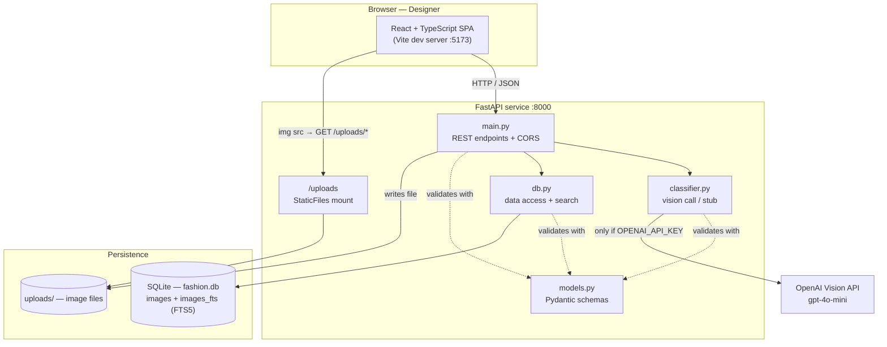

| Module | Owns |
|---|---|
| `main.py` | HTTP routing, request/response shaping, file persistence, CORS |
| `classifier.py` | Turning an image into a `ClassificationResult` (real or stub), parsing model JSON |
| `db.py` | All SQL: schema, insert/update, search, filter-option aggregation, FTS sync |
| `models.py` | Single source of truth for data shapes (shared by all three above) |
| Frontend `api.ts` | The only place that knows backend URLs |
| Frontend components | Pure view + local form state |

## 2. Domain Model — Class UML

Pydantic models in `models.py`. They flow unchanged from classifier -> DB -> API
-> frontend, which is why TypeScript `types.ts` mirrors them 1:1.

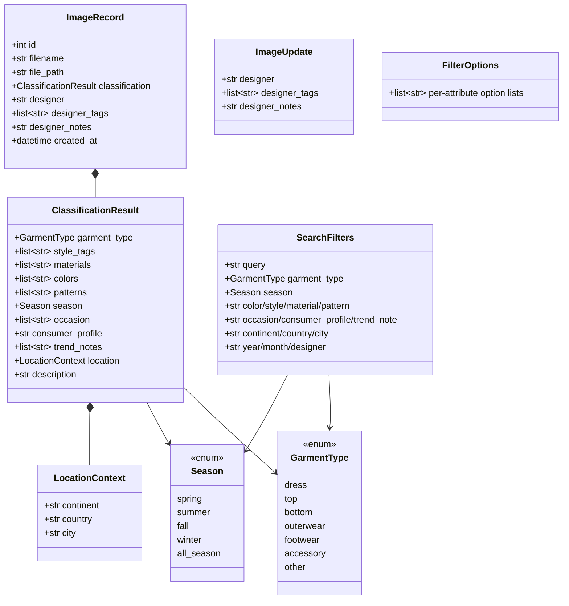

Key decision: AI output (`ClassificationResult`) and human input (`designer*`
fields) are separate attributes on `ImageRecord`, never merged. This is what lets
the UI render an "AI-generated" block distinct from a "Designer input" block.

## 3. Persistence — ER / Storage Model

Two tables. `images` is the system of record; `images_fts` is a denormalized FTS5
mirror kept in sync on every write, keyed by `rowid = images.id`.

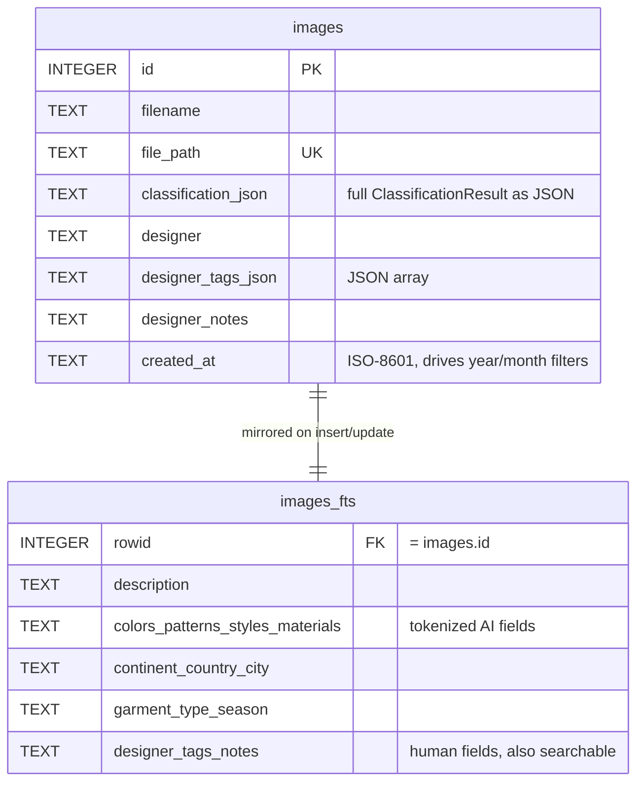

Why this shape:
- Structured attributes live as a JSON blob in `classification_json`, queried with
  SQLite `json_extract` — flexible schema, no migration when the model gains a field.
- Full-text search needs flat tokenized columns, so the same data is also flattened
  into `images_fts`. Both AI text and designer text are indexed, so one query box
  hits both.
- `_sync_fts()` does delete-then-insert on every write so the index never drifts.

## 4. Behavioral UML — Sequence Diagrams

### 4a. Upload + Classify (`POST /images/upload`)

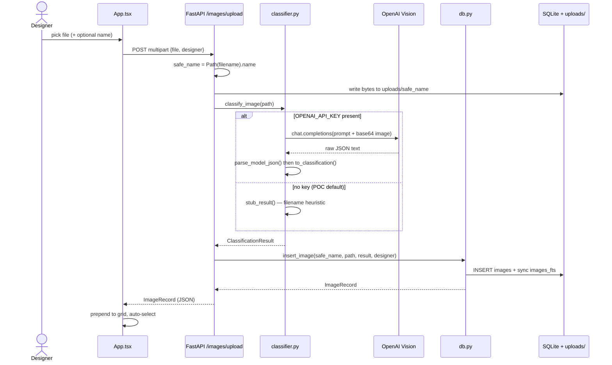

### 4b. Search / Filter (`GET /images`)

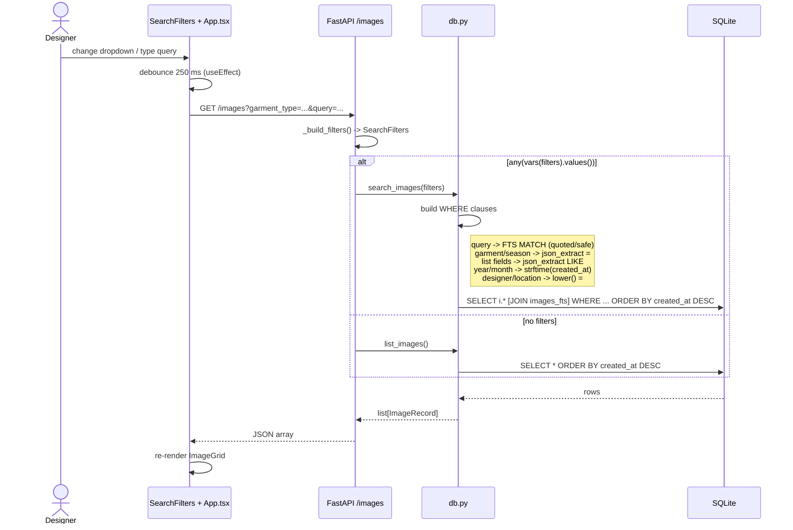

### 4c. Annotate (`PATCH /images/{id}`)

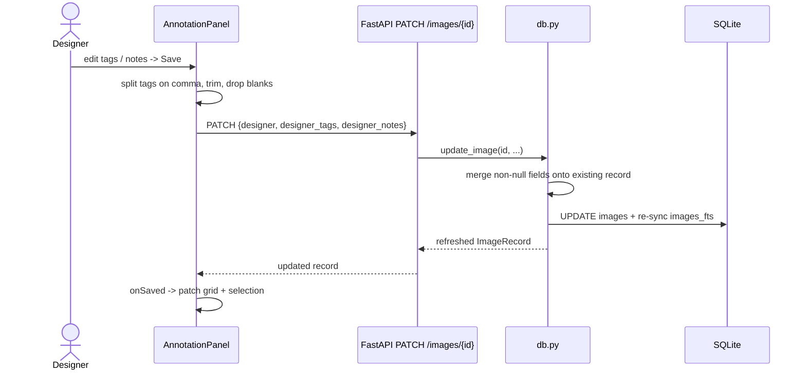

## 5. Dataflow Diagram (DFD, level 1)

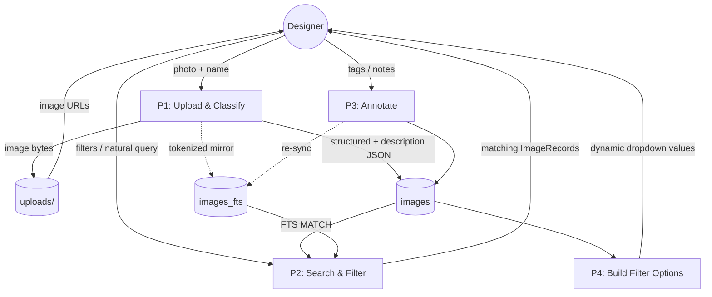

Dropdown options are derived from existing rows (`get_filter_options` scans
`list_images()` and dedupes), never hardcoded.

## 6. Frontend Component & State Architecture

`App.tsx` is the single state owner; children are controlled and communicate
upward via callbacks.

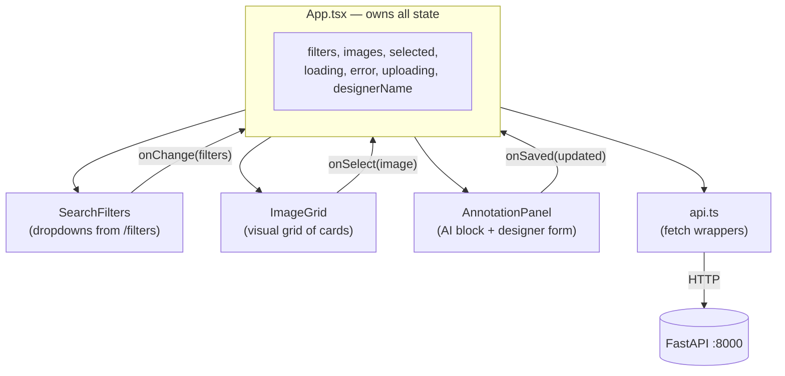

- Debounced loading: `load()` is wrapped in a 250 ms timeout so typing does not
  fire a request per keystroke.
- Optimistic selection: after upload the new record is prepended and auto-selected;
  after a filter reload, selection is preserved by id or falls back to the first item.
- `refreshKey`: `SearchFilters` re-fetches dropdown options whenever
  `images.length` changes, so new attribute values appear after an upload.

## 7. End-to-End Implementation Reference

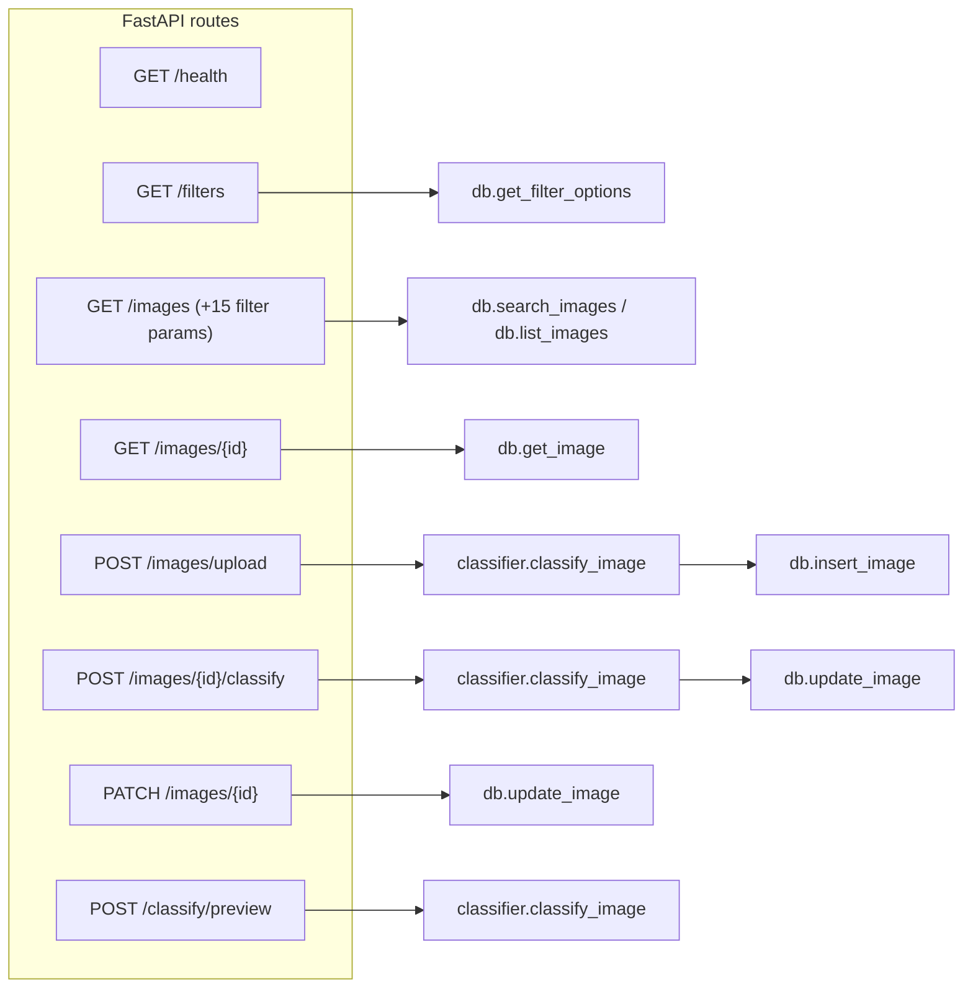

| Method & path | Purpose | Calls |
|---|---|---|
| `GET /health` | liveness | — |
| `GET /filters` | dynamic dropdown options | `get_filter_options` |
| `GET /images` | list or filtered search | `search_images` / `list_images` |
| `GET /images/{id}` | single record | `get_image` |
| `POST /images/upload` | upload -> classify -> store | `classify_image` + `insert_image` |
| `POST /images/{id}/classify` | re-run AI on stored image | `classify_image` + `update_image` |
| `PATCH /images/{id}` | save designer tags/notes | `update_image` |
| `POST /classify/preview` | classify without saving a record | `classify_image` |

### Classification subsystem (`classifier.py`)

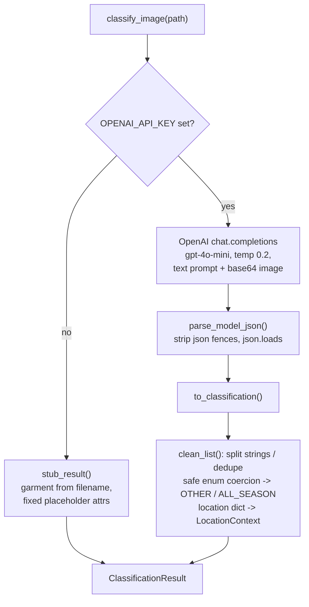

The parse/normalize split (`parse_model_json` -> `to_classification`) is
deliberate: parsing is what the unit test targets, and normalization is where
every "model returned something weird" case is defended (unknown garment type ->
`other`, string instead of list -> split on commas, missing location -> empty
`LocationContext`).

## 8. Model Evaluation Pipeline (`eval/`)

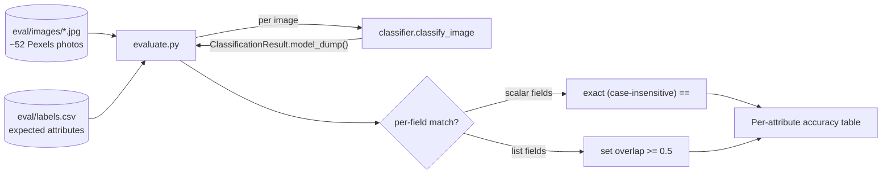

Two scoring strategies, chosen per field type: scalar fields require an exact match;
list fields count as correct if at least 50% of expected tags overlap — a sensible
tolerance for multi-label fashion attributes where model and human will not list
identical sets.

## 9. Known Limitations (POC scope)

- Per-request SQLite connections (`get_db()` opens/closes each call) — fine for a
  single-user POC; would be pooled under real load.
- `get_filter_options` loads all rows into memory to dedupe — O(n) per call,
  acceptable at POC scale, would become `SELECT DISTINCT` / an index at scale.
- AI-inferred location is a best guess, not capture GPS.
- No pagination, deduplication, or multi-user workspaces yet.
